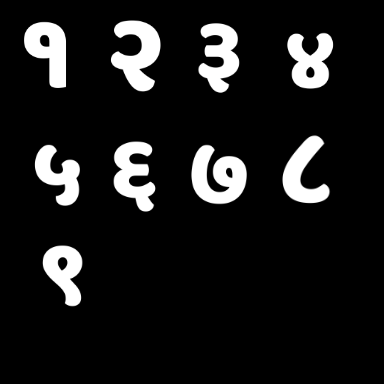

# Nepali Date Notification Icons (1–32)

<p align="center">
  
</p>

<p align="center">
Monochrome Android notification icons (1–32) for Nepali calendar dates, optimized for Android status bar usage.
</p>

---

## ✨ Features

* White monochrome icons (Android compatible)
* Transparent background
* Clean & minimal design
* Supports Nepali dates (1–32)
* Perfect for notification small icons

---

## 📦 Files

* `/icons/` → Individual PNG files
* `ic.date.zip` → All icons in one ZIP

---

## 🚀 Usage (Android)

### 1. Copy icons

```
android/app/src/main/res/drawable/
```

---

### 2. Use in Kotlin

```kotlin
fun getIcon(day: Int): Int {
    return when (day) {
        1 -> R.drawable.ic_day_1
        2 -> R.drawable.ic_day_2
        3 -> R.drawable.ic_day_3
        4 -> R.drawable.ic_day_4
        5 -> R.drawable.ic_day_5
        6 -> R.drawable.ic_day_6
        7 -> R.drawable.ic_day_7
        8 -> R.drawable.ic_day_8
        9 -> R.drawable.ic_day_9
        10 -> R.drawable.ic_day_10
        11 -> R.drawable.ic_day_11
        12 -> R.drawable.ic_day_12
        13 -> R.drawable.ic_day_13
        14 -> R.drawable.ic_day_14
        15 -> R.drawable.ic_day_15
        16 -> R.drawable.ic_day_16
        17 -> R.drawable.ic_day_17
        18 -> R.drawable.ic_day_18
        19 -> R.drawable.ic_day_19
        20 -> R.drawable.ic_day_20
        21 -> R.drawable.ic_day_21
        22 -> R.drawable.ic_day_22
        23 -> R.drawable.ic_day_23
        24 -> R.drawable.ic_day_24
        25 -> R.drawable.ic_day_25
        26 -> R.drawable.ic_day_26
        27 -> R.drawable.ic_day_27
        28 -> R.drawable.ic_day_28
        29 -> R.drawable.ic_day_29
        30 -> R.drawable.ic_day_30
        31 -> R.drawable.ic_day_31
        32 -> R.drawable.ic_day_32
        else -> R.drawable.ic_day_1
    }
}
```

---

## ⚡ Alternative (Dynamic Method)

```kotlin
val iconRes = resources.getIdentifier(
    "ic_day_$day",
    "drawable",
    packageName
)
```

---

## 📥 Download

👉 [Download ZIP](./ic.date.zip)

---

## ⚠️ Important

* Icons must be placed inside the `drawable` folder
* Only white color works for Android notification icons
* Do NOT use colored icons (Android overrides them)

---

## 📜 License

MIT License — free to use, modify, and distribute.

---

## 🙌 Contribution

Pull requests are welcome!

If you find this useful, consider giving a ⭐ on GitHub.
